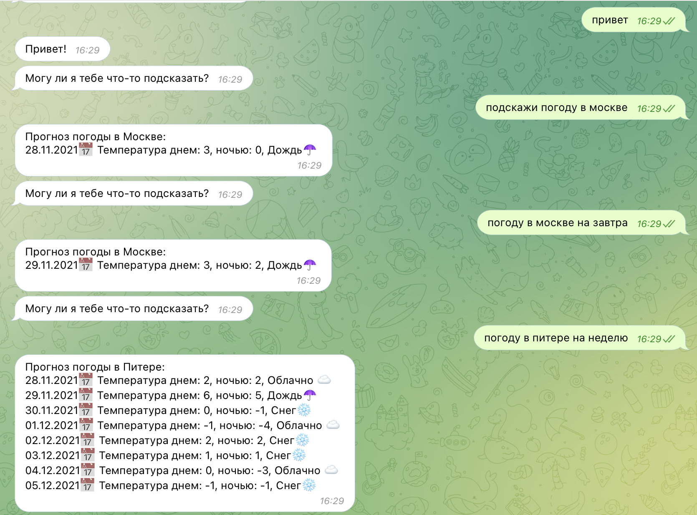
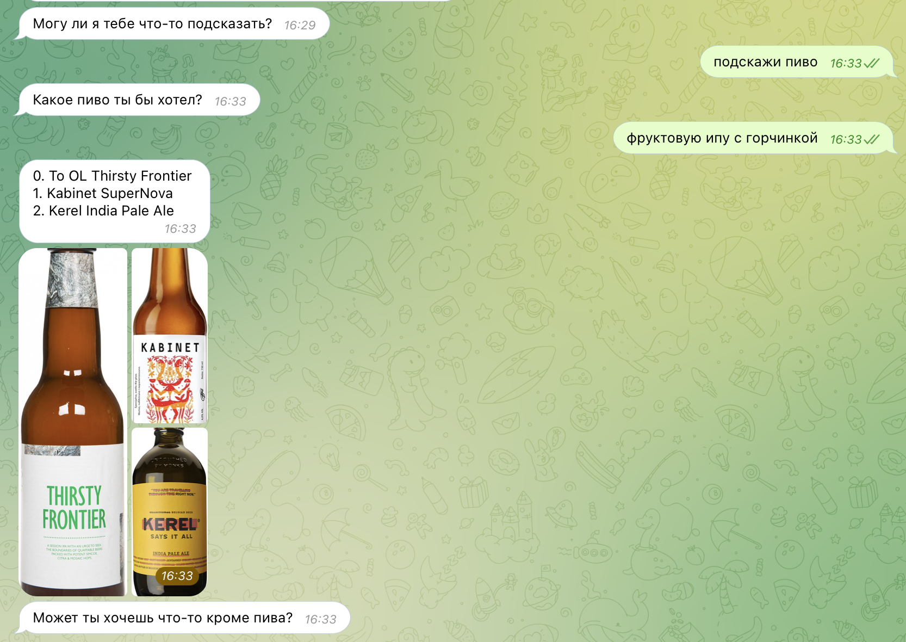
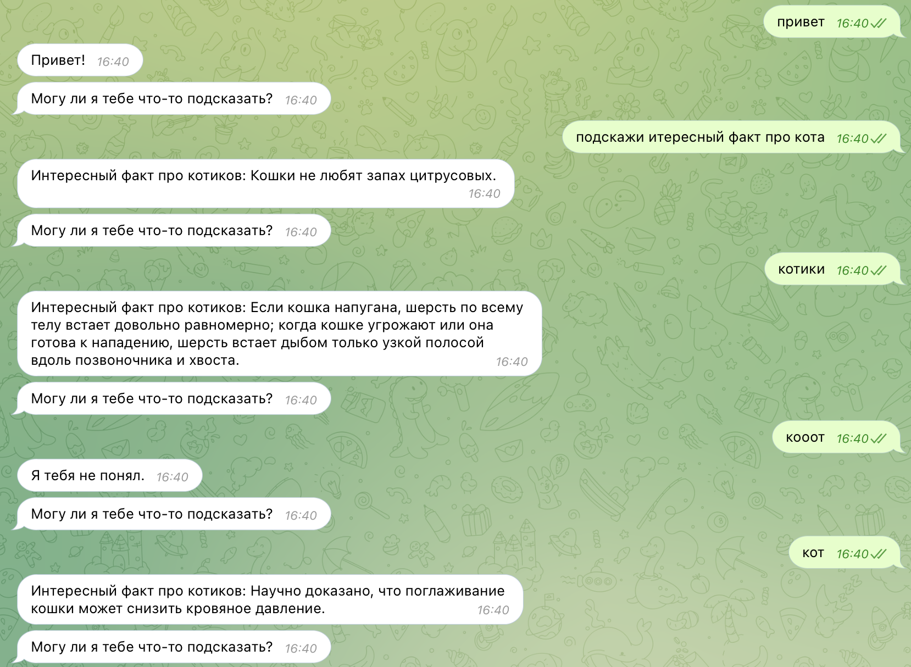

# nlp_bot

Авторы: Корепанов Алексей, Леонов Дмитрий

Бот для телеграма @nlp_pivo_or_not_bot. Обладает слудующим функионалом:

### Показывать погоду

При помощи NER бот распознает город и говорит погоду на сегодня, на завтра и на неделю.

### Рекомендовать пиво

Бот строит эмбеддинг полученного сообщения и ищет ближайший вектор описния пива.  

### Говорить интересные факты про котиков

Только упомяни в диалоге котиков и он сразу тебе расскажет интересный факт про них.

